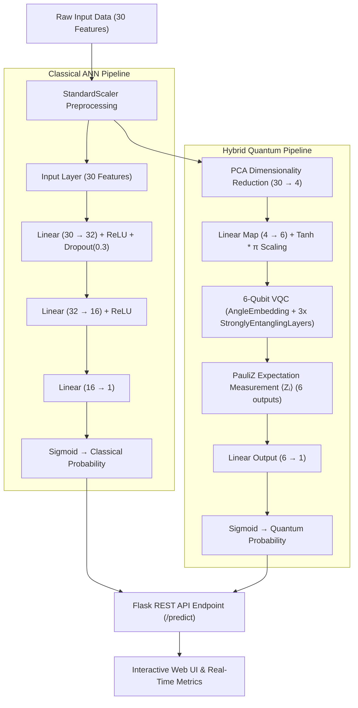
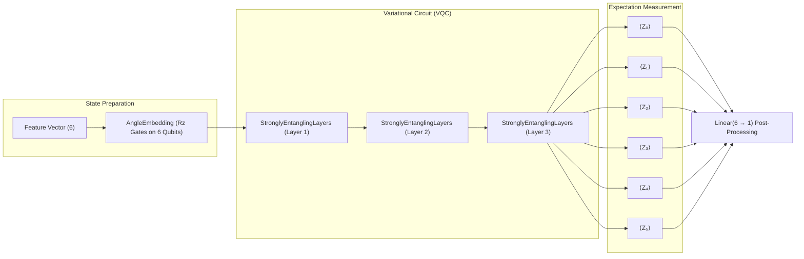

# ⚛️ Quantum vs Classical Financial Fraud Detection

[](https://www.python.org/)
[](https://pytorch.org/)
[](https://pennylane.ai/)
[](https://flask.palletsprojects.com/)
[](https://www.docker.com/)
[](https://huggingface.co/spaces/Sushanth-27/quantum-fraud-detection)

A hybrid Quantum-Classical Machine Learning web application that compares real-time performance, inference latency, and prediction metrics of a **Classical Neural Network (ANN)** against a **Variational Quantum Circuit (VQC)** / Quantum Neural Network (QNN) for financial fraud detection.

🚀 **Live Demo**: [Hugging Face Space Live App](https://huggingface.co/spaces/Sushanth-27/quantum-fraud-detection)

---

## 🏗️ Architecture Overview



---

## ⚡ Quantum Circuit Deep-Dive

The Quantum Model wraps a PennyLane variational circuit (`default.qubit` device) inside a PyTorch `TorchLayer`.



---

## 📊 Model Comparison

| Metric / Parameter | Classical ANN | Hybrid Quantum (VQC) |
| :--- | :--- | :--- |
| **Input Features** | 30 (Full Dataset) | 4 (PCA Reduced) $\rightarrow$ 6 Qubits |
| **Preprocessing** | `StandardScaler` | `StandardScaler` + `PCA` |
| **Architecture** | 3 Linear Layers (30-32-16-1) | Linear(4$\rightarrow$6) $\rightarrow$ 6-Qubit VQC $\rightarrow$ Linear(6$\rightarrow$1) |
| **Quantum Gates** | N/A | `AngleEmbedding` + `StronglyEntanglingLayers` (3 layers) |
| **Measurement** | N/A | Pauli-Z Expectation values on all 6 qubits |
| **Inference Hardware** | CPU / PyTorch | PennyLane Simulator (`default.qubit`) |

---

## 📁 Repository Structure

```
qml_fraud_detection/
├── Quantum_Fraud_Detection.ipynb  # EDA, training, and artifact export
├── app.py                         # Flask web server & inference API
├── classical_model.pth            # Trained PyTorch Classical ANN weights
├── quantum_model.pth              # Trained Hybrid QNN weights
├── scaler.pkl                     # Scikit-Learn StandardScaler artifact
├── pca.pkl                        # Scikit-Learn PCA model artifact
├── check_dims.py                  # Dimension verification script
├── Dockerfile                     # Container deployment script (Gunicorn)
├── requirements.txt               # Dependencies list
├── templates/index.html           # Web UI template
└── static/                        # Frontend CSS / JS assets
```

---

## 🚀 Quick Start

### 1. Local Setup

```bash
# Clone the repository
git clone https://github.com/P-Sushanth/Quantum_CNN_FInancial_Fraud_Detection.git
cd Quantum_CNN_FInancial_Fraud_Detection

# Create & activate virtual environment
python -m venv venv
# Windows:
venv\Scripts\activate
# macOS/Linux:
source venv/bin/activate

# Install dependencies
pip install -r requirements.txt

# Run Flask development server
python app.py
```
> Access app at `http://127.0.0.1:5000`

### 2. Docker Setup

```bash
# Build Docker image
docker build -t qml-fraud-detection .

# Run container (Port 7860)
docker run -p 7860:7860 qml-fraud-detection
```
> Access app at `http://localhost:7860`

---

## 🔌 REST API Reference

### `POST /predict`

**Request Headers**: `Content-Type: application/json`

**Request Body**:
```json
{
  "features": [0.1, -1.2, 0.4, 1.1, -0.5, 0.3, ..., 0.05]
}
```
*(Array of 30 numerical feature values matching Credit Card Fraud dataset format)*

**Response**:
```json
{
  "classical_prediction": "Not Fraud",
  "classical_prob": 0.0124,
  "classical_time": 0.0015,
  "quantum_prediction": "Not Fraud",
  "quantum_prob": 0.0241,
  "quantum_time": 0.0452
}
```

---

## 📜 License

Distributed under the [MIT License](LICENSE).

